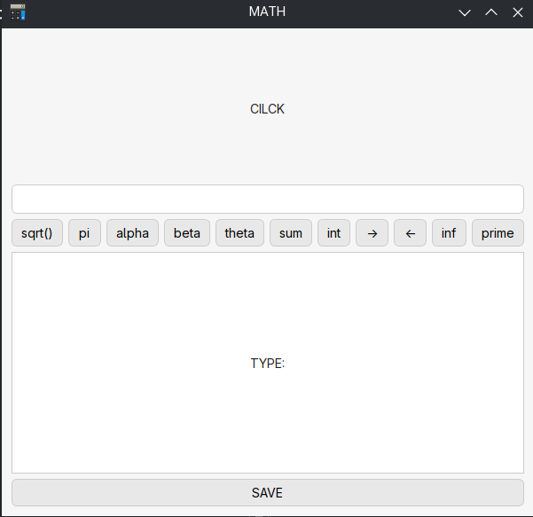
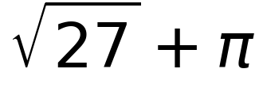

# math-to-photo


A simple  **LaTeX formula renderer** built with **PyQt6** and **Matplotlib**.  
Type mathematical formulas in LaTeX format and instantly preview and export them as PNG images.

---

## Features
- Live formula preview 
- Exports high-quality PNG images 
- Simple and fast

---

## Requirements

Install dependencies:
```bash
pip install PyQt6 matplotlib
```
## example 



---



